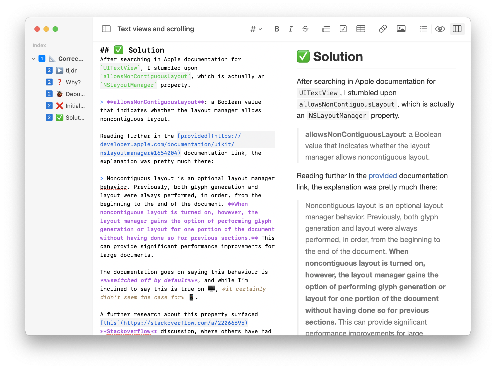

# Typewriter
Typewriter is a **Markdown** editor for 🖥 and 📱 with *syntax highlighting* and *live preview* support, designed to provide a simple and native-feeling user experience.

## Features
### View modes
#### Editor
Distraction-free writing with syntax highlighting and shortcuts for commonly used commands.

#### Preview
View the formatted document, updated as you type and scrolled right where you want.

#### Side-by-side
Keep your *editor* and *preview* next to each other, to get a direct feedback of your writing.

### Index and navigation
Navigate through your document using the **outline sidebar** and the **open quickly** window.

### Assistants
Easy to use interfaces for adding **links**, **images** and **tables**.

### Keyboard shortcuts
Check out all the keyboard shortcuts for most used Markdown features in the **menu bar**.

## Customisation
Change some of the features of the app, such as preferred editing mode and color scheme, in the **preferences window**.

## Privacy
All your documents are saved locally or on your **iCloud Drive**. Typewriter does not track any of your data.
